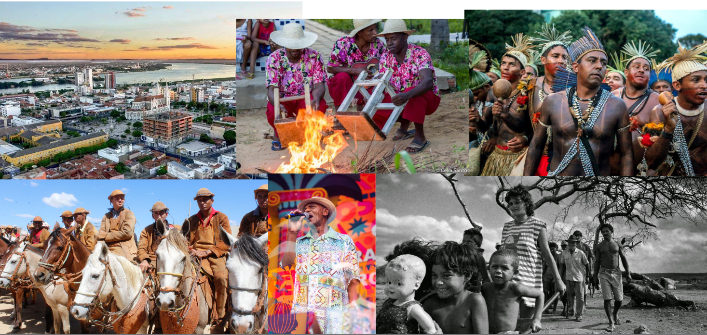
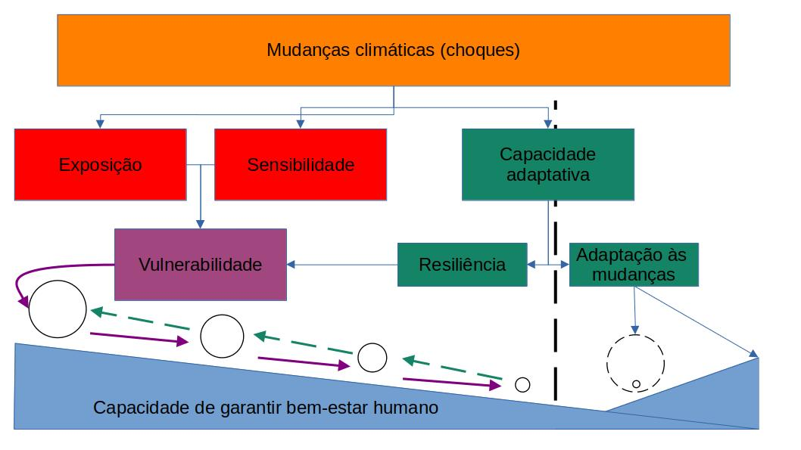
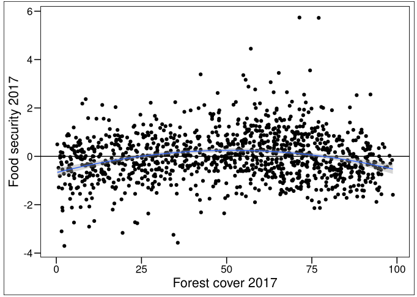
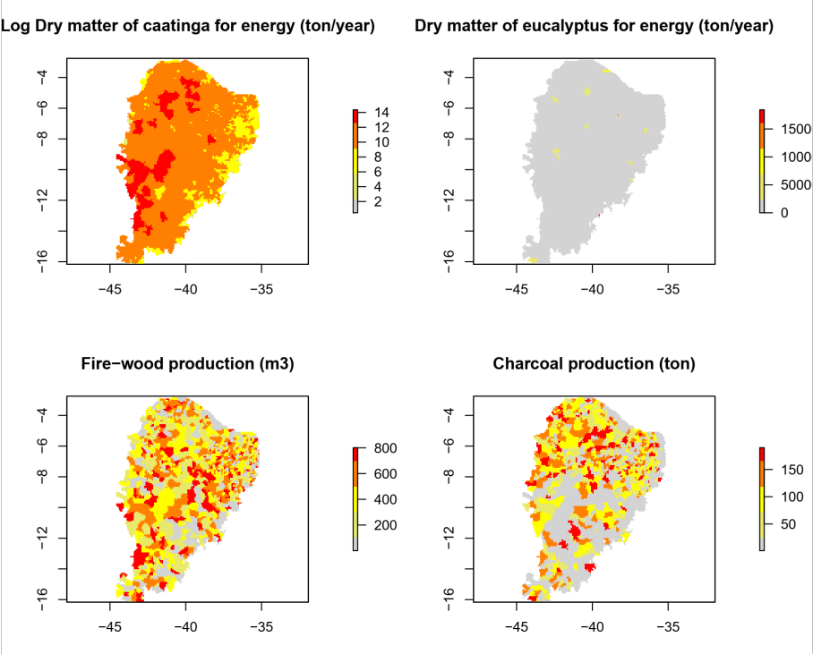
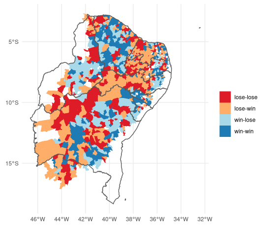

```{r setup, include=FALSE}
options(htmltools.dir.version = FALSE)

```

```{r xaringan-themer, include=FALSE, warning=FALSE}
library(xaringanthemer)
style_duo_accent(
  primary_color = "#1381B0",
  secondary_color = "#FF961C",
  inverse_header_color = "#FFFFFF"
)

style_duo(primary_color = "#1F4257", secondary_color = "#F97B64")
source("https://git.io/xaringan2pdf")


```

# A _Caatinga_, seus povos e suas florestas
.center[
]
---
# A Caatinga, seus _povos_ e suas florestas
```{r, echo=FALSE}

```

---
# A Caatinga, seus povos e suas _florestas_


---
# OBJETIVO: Medir a sensibilidade do socioecossistema da Caatinga às mudanças climáticas
.center[
```{r, echo=FALSE, out.width="80%"}

```
]

---
# Módulo 1 – Segurança florestal e alimentar
.pull-left[
## _Objetivo_ 
### - Entender a relação entre rebanho animal e a cobertura florestal da Caatinga
## _Resultados e produtos esperados_ 
### - Diferenciação entre probreza "verde" e "cinza"
### - Mapas de segurança alimentar para a Caatinga
]
.pull-right[
```{r, echo=FALSE, out.width="120%"}

```
]

---
# Módulo 2 – Segurança florestal e energética
.pull-left[
## _Objetivo_ 
### - Quantificar serviços ambientais energéticos da vegetação Caatinga
## _Resultados e produtos esperados_ 
### - Prever mudanças de biomassa da Caatinga e suas consequências para seus sistemas socioecológicos 
### - Mapas de segurança alimentar para a Caatinga
]
.pull-right[
```{r, echo=FALSE, out.width="120%"}

```
]

---
# Módulo 3 – Promoção de segurança florestal
.pull-left[
## _Objetivo_ 
### - Mapear e quantificar a "insegurança florestal"
## _Resultados e produtos esperados_ 
### - Mapas de insegurança florestal e priorização para restauração ecológica 
### - Quantificação da dependência de SA de florestas
]
.pull-right[
```{r, echo=FALSE, out.width="120%"}

```
]

---
# Agradecimentos:
.pull-left[
### - Dra. Adriana Pelegrinni
### - Dra. Cristina Baldauf
### - Dr. Luke Parry
### - Dr. José Maria Cardoso da Silva
### - Dr. Severino R.R. Pinto
]
.pull-right[
```{r, echo=FALSE, out.width="120%"}
knitr::include_graphics("img/unis.png")
```
]
##contato: felipe.plmelo@ufpe.br
pagedown::chrome_print("https://github.com/fplmelo/site_proj_sus/forest_people_intro.html")
